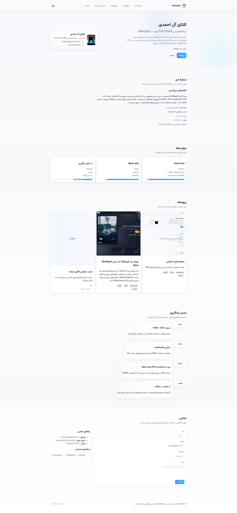
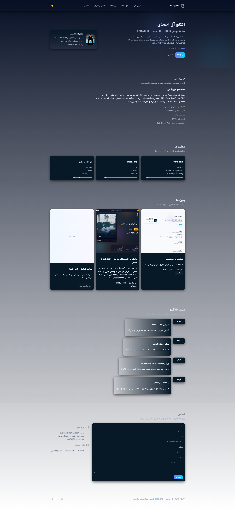

# 🌐 oktayphp Portfolio

<div align="center">


**وب‌سایت شخصی اکتای آل احمدی — برنامه‌نویس Full-Stack**

[](https://github.com/oktayphp/portfolio)
[](https://github.com/oktayphp/portfolio)
[](LICENSE)

[نمایش زنده](https://oktayphp.ir) • [گزارش باگ](https://github.com/oktayphp/portfolio/issues) • [درخواست ویژگی](https://github.com/oktayphp/portfolio/issues)

</div>

---

## 📋 فهرست مطالب

- [درباره پروژه](#-درباره-پروژه)
- [ویژگی‌ها](#-ویژگیها)
- [تکنولوژی‌ها](#️-تکنولوژیها)
- [نصب و راه‌اندازی](#-نصب-و-راهاندازی)
- [ساختار پروژه](#-ساختار-پروژه)
- [تنظیمات](#️-تنظیمات)
- [اسکرین‌شات‌ها](#-اسکرینشاتها)
- [مشارکت](#-مشارکت)
- [لایسنس](#-لایسنس)
- [تماس](#-تماس)

---

## 🚀 درباره پروژه

این پروژه وب‌سایت شخصی (Portfolio) من است که برای نمایش مهارت‌ها، پروژه‌ها و راه‌های ارتباطی طراحی شده است. با تمرکز بر **طراحی مدرن**، **واکنش‌گرا** و **تجربه کاربری بالا** ساخته شده.

### ✨ نکات کلیدی:
- ✅ طراحی کاملاً **Responsive** (موبایل، تبلت، دسکتاپ)
- ✅ حالت **تاریک/روشن** (Dark/Light Mode)
- ✅ **انیمیشن‌های روان** و حرفه‌ای
- ✅ فرم تماس **کاربردی** با PHP
- ✅ کد **تمیز** و **قابل نگهداری**
- ✅ سئو بهینه شده
- ✅ سرعت بالا و عملکرد عالی

---

## 🎯 ویژگی‌ها

### 🎨 طراحی
- **رنگ‌بندی حرفه‌ای** با پالت مدرن
- **تایپوگرافی فارسی** با فونت Vazirmatn
- **گلسمورفیسم** و افکت‌های شیشه‌ای
- **انیمیشن Reveal** هنگام اسکرول
- **Hamburger Menu** برای موبایل

### 💻 عملکردی
- **Typing Effect** برای نمایش مهارت‌ها
- **Smooth Scroll** برای ناوبری
- **Form Validation** کامل
- **Progress Bars** برای نمایش سطح مهارت
- **Timeline** مسیر یادگیری

### 📱 واکنش‌گرا
- موبایل (< 768px)
- تبلت (768px - 1024px)
- دسکتاپ (> 1024px)

---

## 🛠️ تکنولوژی‌ها

<div align="center">

| Front-end | Back-end | Tools |
|-----------|----------|-------|
|  |  |  |
|  |  |  |
|  | - |  |

</div>

---

## 📦 نصب و راه‌اندازی

### پیش‌نیازها
- وب‌سرور (Apache/Nginx)
- PHP 7.4 یا بالاتر
- Git

### مراحل نصب

1️⃣ **کلون کردن مخزن:**
---
```bash
git clone https://github.com/oktayphp/portfolio.git
```
```bash
cd portfolio
```
2️⃣ تنظیم فایل contact.php:
---
PHP

// در خط 14 فایل contact.php ایمیل خود را وارد کنید:
```bash
$recipient_email = 'your-email@example.com';
```
3️⃣ راه‌اندازی سرور محلی:
---
با PHP Built-in Server:

```bash
Bash

php -S localhost:8000
```
با XAMPP/WAMP:

فایل‌ها را در پوشه htdocs قرار دهید
از طریق http://localhost/portfolio دسترسی داشته باشید

4️⃣ مشاهده در مرورگر:
---
http://localhost:8000
📁 ساختار پروژه
```bash

portfolio/
│
├── assets/
│   ├── css/
│   │   └── style.css          # استایل‌های اصلی
│   ├── js/
│   │   └── script.js          # اسکریپت‌های JavaScript
│   └── images/
│       ├── logo.svg
│       ├── profile.jpg
│       ├── project1.jpg
│       └── project2.jpg
│
├── index.html                  # صفحه اصلی
├── contact.php                 # مدیریت فرم تماس
├── README.md                   # مستندات
└── LICENSE                     # مجوز پروژه
```
---
⚙️ تنظیمات
🎨 تغییر رنگ‌ها
در فایل assets/css/style.css:

CSS
```bash
:root {
  --primary: #0066cc;     /* رنگ اصلی */
  --secondary: #00d4ff;   /* رنگ ثانویه */
  --dark: #0f1724;        /* پس‌زمینه تیره */
  /* ... */
}
```
---
📧 تنظیم فرم تماس
در فایل contact.php:

PHP

// ایمیل دریافت‌کننده
```bash
$recipient_email = 'your-email@example.com';
```
// نام سایت
```bash
$site_name = 'Your Portfolio';
```
---

📸 اسکرین‌شات‌ها
<div align="center">
  
Light Mode

Dark Mode

Mobile View


</div>

🤝 مشارکت
```bash
مشارکت‌ها، گزارش باگ‌ها و درخواست‌های ویژگی همیشه خوشامد هستند!

مراحل مشارکت:
Fork کردن پروژه
ایجاد Branch ویژگی (git checkout -b feature/AmazingFeature)
Commit تغییرات (git commit -m 'Add some AmazingFeature')
Push به Branch (git push origin feature/AmazingFeature)
باز کردن Pull Request
گزارش باگ
برای گزارش باگ، لطفاً Issue جدید ایجاد کنید.
```
📄 لایسنس
این پروژه تحت مجوز MIT License منتشر شده است. برای جزئیات بیشتر فایل LICENSE را مشاهده کنید.

```bash

MIT License - شما آزاد هستید:
✅ استفاده تجاری
✅ تغییر و ویرایش
✅ توزیع
✅ استفاده شخصی
📞 تماس
```
<div align="center">
اکتای آل احمدی - برنامه‌نویس Full-Stack

Email
Instagram
Telegram
GitHub

لینک پروژه: https://github.com/oktayphp/portfolio

وب‌سایت: https://oktayphp.ir

</div>
<div align="center">
⭐ اگر این پروژه برایتان مفید بود، لطفاً یک ستاره بدهید!
ساخته شده با ❤️ توسط oktayphp

Made with Love
Persian

</div> 
